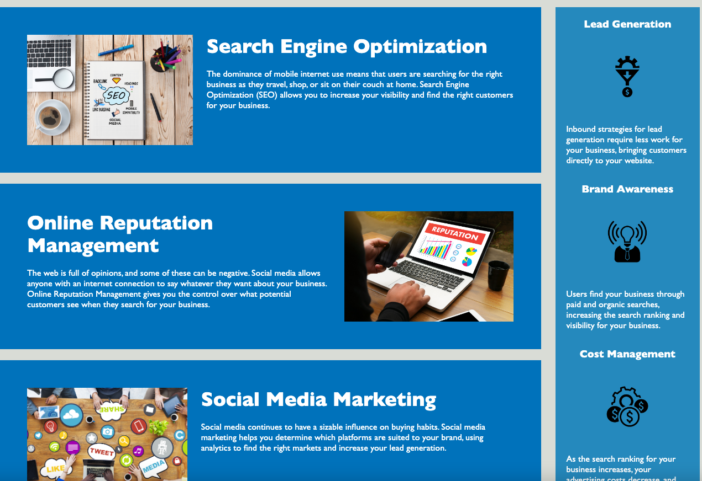
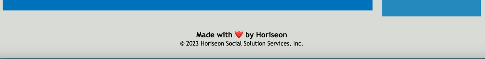

# Sample_Webpage

## Description

A sample webpage to practice web design, semantics, and other best practices. This webpage contains a functional navigation bar, a hero, and aside with more information next to the articles.

## Installation

N/A

## Usage

Deployed Site: https://ravensandcrows.github.io/Sample_Webpage/

Here there is a functional navigation bar and a hero image that is set as a background. Below are the blogs:

Here there are blog posts with relevant IDs and classes within the HTML. These are set next to an aside that provides more information for viewers of the site.

The webpage also contains a footer with the company name, copyright, and a message.
## Credits

https://www.w3schools.com/html/html5_semantic_elements.asp

## License

Please refer to the LICENSE in the repo.
